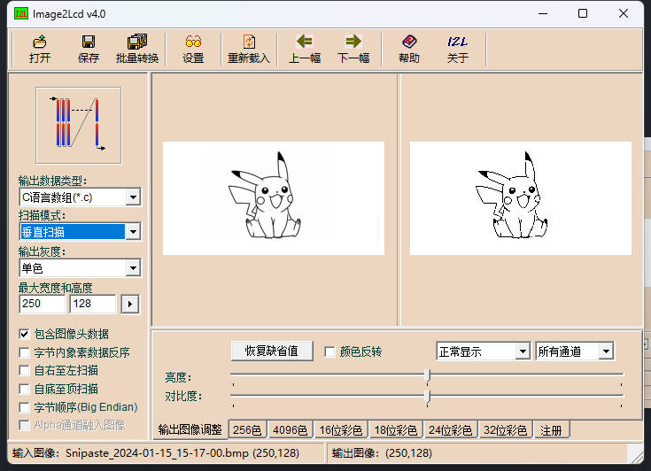

<h1 align = "center">🌟LilyGo LoRa Epaper Series🌟</h1>

## **English | [中文](./README_CN.MD)**
## 1️⃣Quick start:

### PlatformIO Quick Start (Recommended)

- Install `Visual Studio Code` and `Python`
- Search for the `PlatformIO.IDE` plugin in the `Visual Studio Code` extension and install it, after the installation is complete, you need to restart `Visual Studio Code`
- After restarting `Visual Studio Code`, select the `File` -> `Open Folder` -> `LILYGO-LORA-EPAPER-SERIES` directory in the upper left corner of `Visual Studio Code`
- Open the `platformio.ini` file and click in the platformio column to uncomment one line, `default_envs` = xxxx, to ensure that only one line is valid
- Click the (✔) symbol in the bottom left corner to compile
- Connect the circuit board to the USB port of the computer
- Click (→) to upload firmware
- Click (plug symbol) to monitor serial port output

## USE Arduino IDE

1. Install the current upstream Arduino IDE at the 1.8 level or later. The current version is at the [Arduino website](http://www.arduino.cc/en/main/software). (NOTE: MacOS may require that you install separate drivers to interact with your board. You will get error messages that occur when the IDE attempts to upload code. You should consider running the Arduino IDE in a Virtual Machine on Linux. Installing other drivers on your Mac is out of scope for this document.)
2. Start Arduino and open Preferences window. In additional board manager add url: `https://raw.githubusercontent.com/espressif/arduino-esp32/gh-pages/package_esp32_index.json` If you have multiple URLs (e.g., for other boards), just add previously mentioned URL, separated by a comma.
3. Copy all folders in the `lib` directory to your Arduino Libraries Directory,
- in MacOS, it is `~/Documents/Arduino/libraries`
- in Linux, it is `~/Arduino/libraries` 
- in Windows, it is `Documents/Arduino/libraries` 
4. Open the corresponding example
5. In the Arduino Application, navigate to the Board Manager menu ("Tools => Board => Board Manager"), search for `esp32`, and make sure that you install the latest version. After you do this, you can select the board you have from the list of boards in the "ESP32 Arduino" menu ("Tools=> Board => ESP32 Arduino"). It`s very important to note that the list of boards is NOT in alphabetical order. Look for the board you are working with carefully in the list. 
6. `Lilygo-LoRa-Epaper-series` users can choose `ESP32S3 Dev Module`
7. Select the port of the board in the port
8. Please uncomment the `utility.h` file above each sketch based on your board model, otherwise compilation will report an error
9. Upload


## 2️⃣Example description
```
├─ ArduinoLoRa       # Only support SX1276/SX1278 radio module
│  ├─LoRaReceiver
│  └─LoRaSender
├── Display        
│   ├── GxEPD_U8G2_Fonts_Demo
│   └── GxEPD_picture_examples
├─ RadioLibExamples              # RadioLib examples,Support SX1276/78/62/80
│  ├─SX1262
│  │  ├─SX1262_Receive_Interrupt
│  │  └─SX1262_Transmit_Interrupt
│  ├─SX1268
│  │  ├─SX1268_Receive_Interrupt
│  │  └─SX1268_Transmit_Interrupt
│  ├─SX1276
│  │  ├─SX1276_Receive_Interrupt
│  │  └─SX1276_Transmit_Interrupt
│  ├─SX1278
│  │  ├─SX1278_Receive
│  │  ├─SX1278_Receive_Interrupt
│  │  ├─SX1278_Transmit
│  │  └─SX1278_Transmit_Interrupt
│  ├─SX1280
│  │  ├─SX128x_Receive_Interrupt
│  │  └─SX128x_Transmit_Interrupt
├──SD        
│   ├── SD_Test
│   └── SD_Epaper_Test
└─SleepTest
```


## 3️⃣PinOut

- View 'utilities.h' in each example folder


## 4️⃣Datasheet


- [SX1262](https://www.semtech.com/products/wireless-rf/lora-transceivers/sx1262)
- [SX1278](https://www.semtech.com/products/wireless-rf/lora-transceivers/sx1278)
- [SX1276](https://www.semtech.com/products/wireless-rf/lora-transceivers/sx1276)
- [SX1280](https://www.semtech.cn/products/wireless-rf/lora-connect/sx1280)

## 5️⃣Announcements

1. After setting the LoRa output power, set the lowest current. Set sx1262 as follows :

```
    // digitalWrite(LoRa_Busy, LOW);
    // set output power to 10 dBm (accepted range is -17 - 22 dBm)
    if (radio.setOutputPower(22) == RADIOLIB_ERR_INVALID_OUTPUT_POWER) {
        Serial.println(F("Selected output power is invalid for this module!"));
        while (true);
    }


    // set over current protection limit to 80 mA (accepted range is 45 - 240 mA)
    // NOTE: set value to 0 to disable overcurrent protection
    if (radio.setCurrentLimit(80) == RADIOLIB_ERR_INVALID_CURRENT_LIMIT) {
        Serial.println(F("Selected current limit is invalid for this module!"));
        while (true);
    }
```
2. Ink screen takeout:

Note: The size of the display picture should be consistent with the width and height of the ink screen otherwise it may not achieve the display effect

The following is a reference image: ⚠️ The size of the image is 250*128



Use the mold taking software `image2lcd`

Select `Output data type` as` C Language Array `

Select `Scan Mode` as` Vertical Scan `

Select Output Grayscale to Monochrome

Select `maximum width and height` according to the size of the ink screen

After opening the file, you need to delete the first six bits in the array and add a reference to it

## 6️⃣Arduino setting

| Setting                  | Value                            |
|--------------------------|----------------------------------|
| Board                    | ESP32S3 Dev Module               |
| Upload Speed             | 921600                           |
| USB Mode                 | Hardware CDC and JTAG            |
| USB CDC On Boot          | Enabled                          |
| USB Firmware MSC On Boot | Disabled                         |
| USB DFU On Boot          | Disabled                         |
| CPU Frequency            | 240MHz (WiFi)                    |
| Flash Mode               | QIO 80MHz                        |
| Flash Size               | 4MB (32Mb)                       |
| Core Debug Level         | None                             |
| Partition Scheme         | Default 4MB with spiffs          |
| PSRAM                    | OPI PSRAM                        |
| Arduino Runs On          | Core 1                           |
| Events Run On            | Core 1                           |